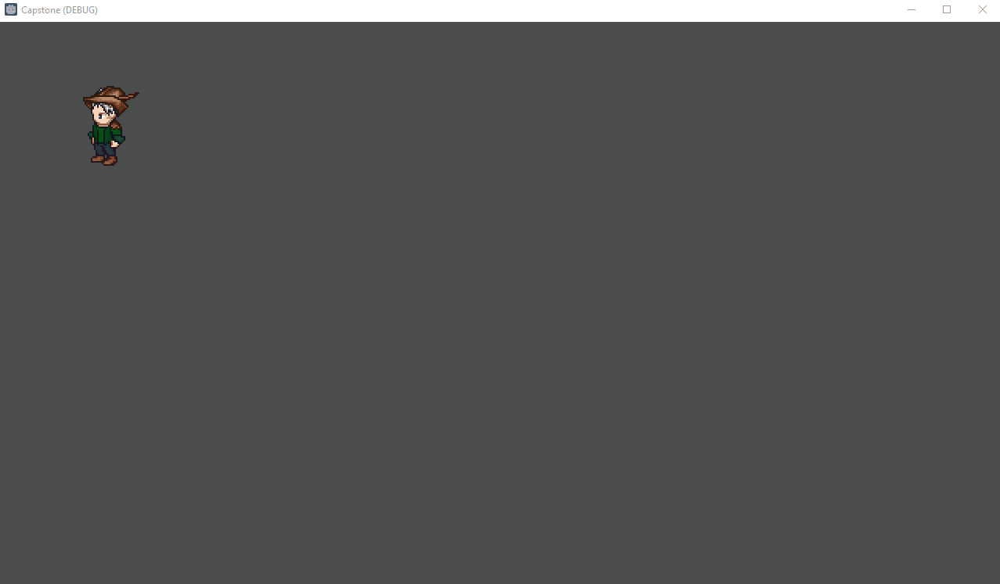
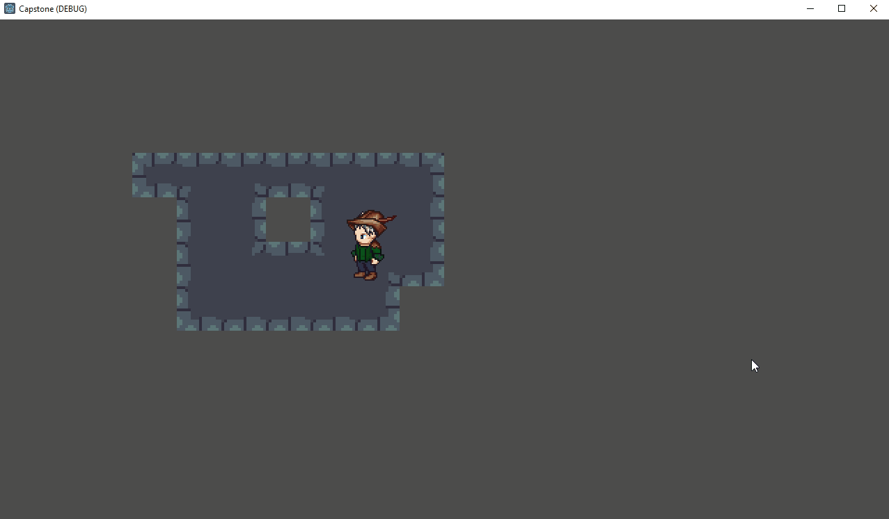
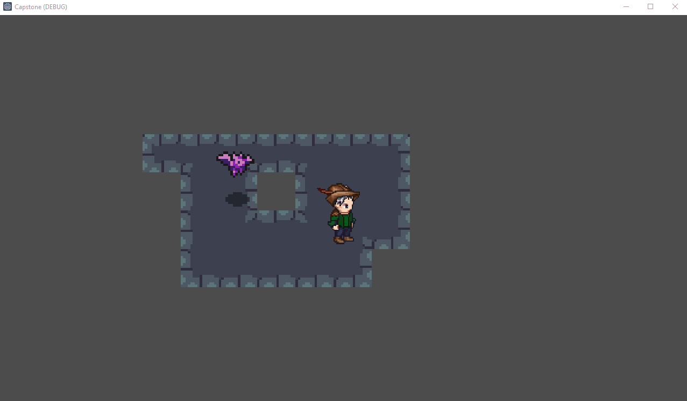
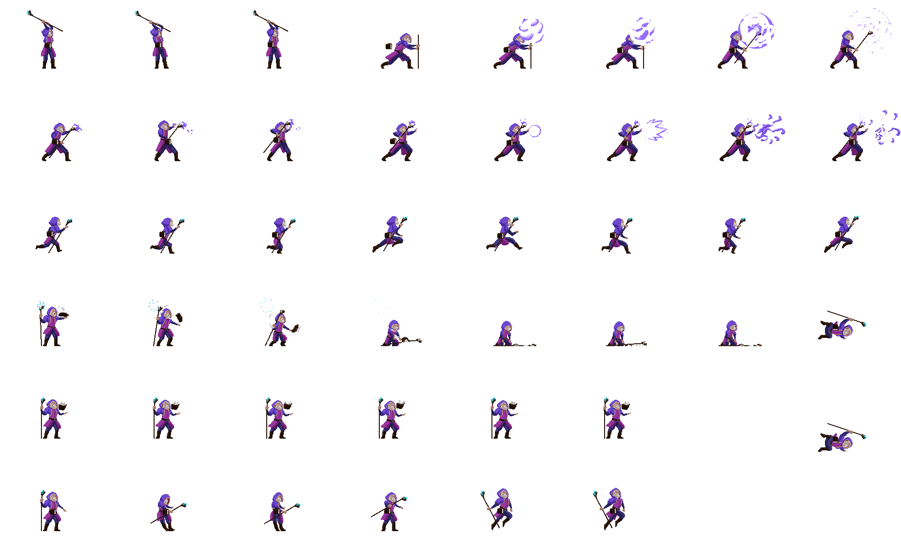
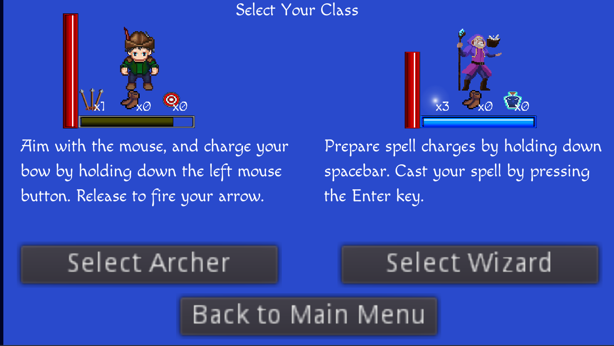
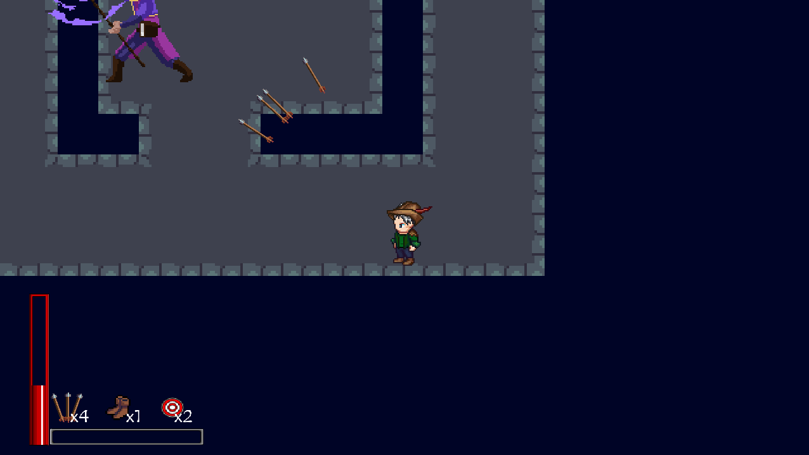

# AR Dungeon Crawler (Senior Capstone Project)

## Contributors
- Danny Chung
- Matthew Roberts (robertm8 / mrobert09)
- Jin Wu

## Technologies Used
- Python 3.9
- Godot 3.4.4 (using GDScript as the programming language)

## Project Overview
This project was created for our Senior Capstone at Oregon State university. After reviewing multiple project types, our team unanimously agreed to work on a dungeon crawler game with augmented reality components. The goal of the game is to eliminate the enemies on the screen using one of two characters, and then to defeat a boss character. Our project utilized the free, open-source game engined Godot as well as some Python scripting to handle the AR functionality.

## Project Components
### Godot Engine
Each project member spiked a different platform for development of this game. Between PyGame, Godot, and T-Engine4, the team decided to use Godot as there were ample resources available on it and it was repeatedly rated among the best (or the best) free game development engines available.

### OpenCV
To build the AR component of the game, the Python library OpenCV was used. This took a hand drawn or computer drawn image on graph paper and converted it into a 2D array using thresholding, Gaussian blur, and bit masking. This 2D array could then be parsed and translated into a dungeon layout inside Godot. The creator can use 4 different elements when drawing the dungeon to affect the layout: edges for walls, triangles for enemy spawn positions, a square for the player starting position, and an asterisk which is currently unused.

Here is a link to the algorithm created by Danny Chung: https://github.com/chungd87/Image-to-Grid-Conversion-Algorithm

### Various Free Open Source Artwork and Audio Resources
A variety of resources were used to produce the artwork and audio in this game. For a detailed description, please refer to the Credits.md file. But in general, most artwork and audio were sourced from:
- https://opengameart.org/
- https://www.youtube.com/c/uheartbeast
- https://itch.io/game-assets
- https://sanderfrenken.github.io/Universal-LPC-Spritesheet-Character-Generator/#?body=Humanlike_white

In addition several programs were utilized for editing / customizing different sprites. These were:
- https://www.tilesetter.org/
- https://pixlr.com/x/

## Gameplay Development Screenshots
### First sprite added to game with animations and proper turning

### Tilemap added and basic collision with player

### First enemies added and mouse based turning

### Bow draw and arrow firing animation

### Enemy hitbox and death added

### Sprite sheet of playable wizard class (also the boss!)

### New character select screen and preview of UI elements

### Screenshot of UI components and powerup system (here player can shoot 4 arrows at once)

### Added enemy variety and updated enemy skills so red bats can fireballs at player with appropriate hitboxes and collision

### Playable wizard class

