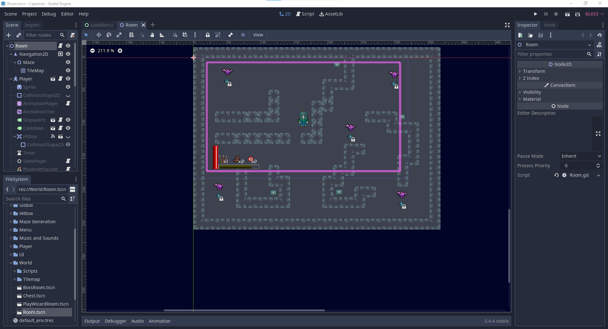

# AR Dungeon Crawler (Senior Capstone Project)

## Contributors
- Danny Chung
- Matthew Roberts (robertm8 / mrobert09)
- Jin Wu

## Technologies Used
- Python 3.9
- Godot 3.4.4

## Project Overview
This project was created for our Senior Capstone at Oregon State university. After reviewing multiple project types, our team unanimously agreed to work on a dungeon crawler game with augmented reality components. The goal of the game is to eliminate the enemies on the screen using one of two characters, and then to defeat a boss character. Our project utilized the free, open-source game engined Godot as well as some Python scripting to handle the AR functionality.

## Project Components
### Godot Engine
Each project member spiked a different platform for development of this game. Between PyGame, Godot, and T-Engine4, the team decided to use Godot as there were ample resources available on it and it was repeatedly rated among the best (or the best) free game development engines available.

